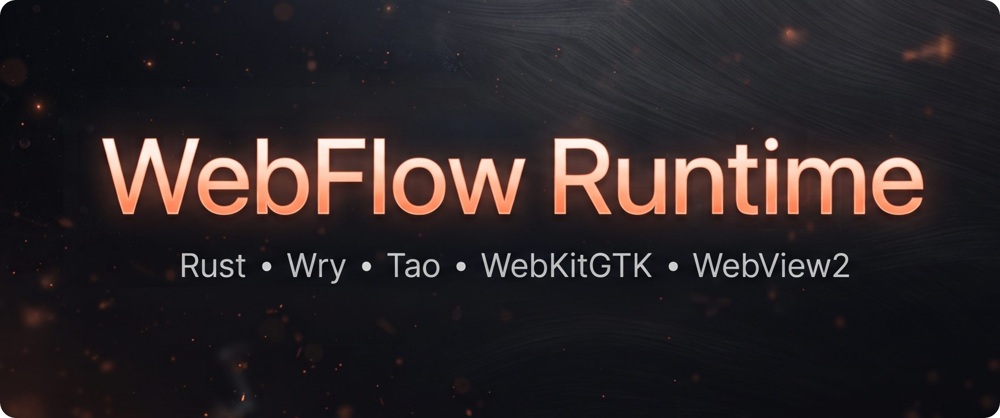

# WebFlow Runtime Project (now on Rust)

  

  <b>This fork</b> of my WebFlow Runtime project has been <b>completely rewritten in Rust language</b>, instead of the heavy and slow <b>Python language</b>!

---

## Disclaimer & Warning

> [!WARNING]
> **Project Under Development!**
> 
> This software is not yet intended for daily use — only **dev builds** are currently available. 
> 
> If you are testing the application and encounter any bugs or issues, please report them by opening a GitHub [Issue](issues).

This project is quite difficult to rewrite from Python technologies (PyQt and QtWebEngine) to the Rust language, so the project has not yet been fully developed. But work on it is in full swing, you can still download and test it. And your readings about bugs and problems will greatly help to finish the project faster.
